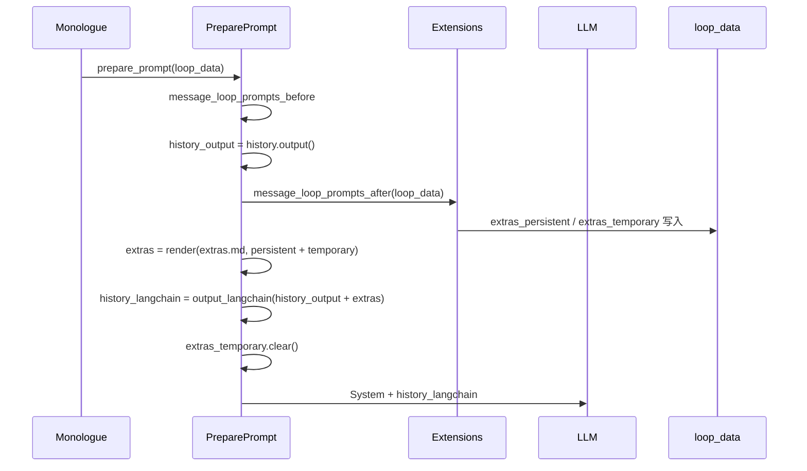

# Extras 逻辑详解

## 一、Extras 是什么

**Extras** 是一块**每轮动态拼出来的“附加上下文”**，在构建发给大模型的 prompt 时，和**对话历史（history_output）**拼在一起，一起转成 LangChain 消息列表。  
它不进入持久化的 Topic/History，只在本轮「prepare_prompt」里用一次，用来给模型提供当轮需要的环境信息（时间、技能、记忆、工作目录、当前阶段性结果等）。

---

## 二、数据从哪来：LoopData 上的两个字典

Extras 的内容来自 [agent.py](agent.py) 里 **LoopData** 上的两个有序字典（每轮用的是**同一份** LoopData，直到用户发下一条消息才会新建）：

```python
# agent.py 约 332-333 行
self.extras_temporary: OrderedDict[str, history.MessageContent] = OrderedDict()
self.extras_persistent: OrderedDict[str, history.MessageContent] = OrderedDict()
```

| 字段 | 谁写入 | 何时清空 | 含义 |
|------|--------|----------|------|
| **extras_persistent** | 在 `message_loop_prompts_after` 里跑的 extension（如 recall_memories、loaded_skills） | 不清空，持续到本轮 monologue 结束 | 本段对话内希望**每轮都带上的**信息（记忆、已加载技能等） |
| **extras_temporary** | 同上的 extension（如 current_datetime、agent_info、workdir、local_results） | **每轮**在 `prepare_prompt` 里用过之后 **立刻 clear**（约 561 行） | 仅**当前这一轮**要带的临时信息（当前时间、当前 agent 信息、当前目录、当前阶段性结果等） |

也就是说：

- **persistent**：本 monologue 内多轮共享，不主动清。
- **temporary**：每轮重新填、用一次就清，下一轮再由 extension 重新写。

---

## 三、何时、由谁往 Extras 里写

写入发生在 **message_loop_prompts_after** 的 extension 里（在 `prepare_prompt` 里先算好 `history_output`，再跑这些 extension，最后再拼 extras 并清 temporary）。

当前代码里往 extras 里写的典型 extension 有：

- [\_50_recall_memories.py](python/extensions/message_loop_prompts_after/_50_recall_memories.py)：往 **extras_persistent** 写 `memories`、`solutions`（召回的记忆/方案）。
- [\_60_include_current_datetime.py](python/extensions/message_loop_prompts_after/_60_include_current_datetime.py)：往 **extras_temporary** 写 `current_datetime`。
- [\_65_include_loaded_skills.py](python/extensions/message_loop_prompts_after/_65_include_loaded_skills.py)：往 **extras_persistent** 写 `loaded_skills`。
- [\_70_include_agent_info.py](python/extensions/message_loop_prompts_after/_70_include_agent_info.py)：往 **extras_temporary** 写 `agent_info`。
- [\_75_include_workdir_extras.py](python/extensions/message_loop_prompts_after/_75_include_workdir_extras.py)：往 **extras_temporary** 写 `project_file_structure`。
- [\_91_recall_wait.py](python/extensions/message_loop_prompts_after/_91_recall_wait.py)：可能往 **extras_temporary** 写 `memory_recall_delayed`。

若实现「阶段性结果注入」，也会在这里往 **extras_temporary**（或 persistent）里写一块 key（如 `partial_result`），value 为 `partial_result.md` 的内容或摘要。

---

## 四、在 Prompt 里怎么用：从字典到最终消息

在 [prepare_prompt](agent.py)（约 535–565 行）里：

1. **先跑完** `message_loop_prompts_before`（例如整理 history），再算 `history_output`，再跑 **message_loop_prompts_after**（上面那些 extension 往 `extras_persistent` / `extras_temporary` 里写）。
2. **拼成一个字典**：`{**loop_data.extras_persistent, **loop_data.extras_temporary}`（persistent 先，temporary 后，同 key 时 temporary 覆盖）。
3. **渲染成一段文本**：用模板 [prompts/agent.context.extras.md](prompts/agent.context.extras.md) 渲染，模板内容等价于：
   - `[EXTRAS]\n{{extras}}`
   - 其中 `{{extras}}` 是上一步字典的 **JSON 字符串**（如 `dirty_json.stringify(...)`），所以模型看到的是一段带 `[EXTRAS]` 标题的 JSON 文本。
4. **转成“消息”**：用 `history.Message(False, content=上述文本).output()` 得到一条「Human」侧的 OutputMessage，再和 `history_output` 一起交给 `history.output_langchain(loop_data.history_output + extras)`。
5. **合并同类型消息**：`output_langchain` 里会对连续同类型（如多条 Human）做 **group_outputs_abab**，所以若 history 末尾已经是 Human，extras 这段可能会和上一条 Human 合并成一条。
6. **清空临时**：`loop_data.extras_temporary.clear()`，下一轮 temporary 从空开始，再由 extension 重新写。

因此：**extras 在模型侧 = 出现在“对话历史”末尾的一段（或合并进最后一条）Human 消息，内容为 `[EXTRAS]` + 一串 JSON**，模型可以据此看到当前时间、技能、记忆、工作目录、阶段性结果等。

---

## 五、和 History 的关系

- **History（Topic/Bulk）**：持久化在对话里，会参与压缩、摘要，是“真正的”对话历史。
- **Extras**：**不**写入 Topic；每轮在内存里按 `extras_persistent` + `extras_temporary` 现算一遍，只参与**当轮** prompt 的构建，用完即止（temporary 还被 clear）。
- 在 `prepare_prompt` 里，发给模型的序列是：**System + (history_output + extras 转成的 LangChain 消息)**，所以 extras 在“历史”的**最后**，从模型视角像是一条（或一段）额外的用户侧上下文。

---

## 六、若要把「阶段性结果」注入给模型

若希望模型**每轮**都看到当前 `partial_result.md` 的内容（而不仅是上次 save 时插入历史的那一条），可以：

- 在 **message_loop_prompts_after** 里加一个 extension（例如 computer 的 `_20_partial_result_inject.py`）。
- 在该 extension 里：读当前会话的 `partial_result.md`，若存在则设  
  `loop_data.extras_temporary["partial_result"] = 文件内容或摘要`。
- 这样在当轮 `prepare_prompt` 里，这段会和其他 extras 一起被 stringify 进 `[EXTRAS]` 的 JSON，模型就能在每轮都看到最新阶段性结果，且**不占用**持久化 history，也不参与 history 压缩。

---

## 七、流程简图



总结：**extras = 当轮 prompt 末尾的附加上下文块，由 persistent（本 monologue 共享）和 temporary（当轮专用、用后即清）合并成 JSON 塞进一条 Human 消息，不落库、不参与 history 压缩。**
